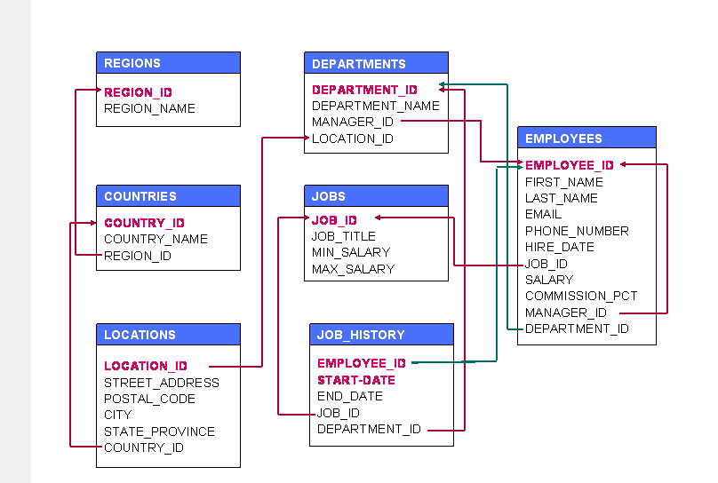

#### Сайты с задачами

1. [msql](https://proglib.io/p/sql-questions)
2. [задачи + теория](https://dou.ua/lenta/articles/sql-questions/)

### Задача 1. Гребаные кошки

#### Вводные
```
CREATE TABLE public.pets (
    id integer,
    animal character varying(255)
);

COPY public.pets (id, animal) FROM stdin;
1	кошка
2	кошка
2	собака
3	пони
4	питон
4	мышь
4	хомяк
\.
```

#### Задача
Вывести всех суотрудников, у которых нет кошек
```
select distinct t1.id from pets as t1 left join pets as t2 on t1.id = t2.id and t2.animal = 'кошка' where t2.id is null
```

### Задачи из habr-статьи. По схеме



#### Задача 1
Таблица Employees. Получить список всех сотрудников из 50го отдела (department_id) с зарплатой(salary), большей 4000
```
select * from employees where department_id = 50 and salary > 4000  
```

#### Задача 2
Таблица Employees. Получить список всех сотрудников у которых в имени содержатся минимум 2 буквы 'n'
```
SELECT *
  FROM employees
 WHERE first_name LIKE '%n%n%';
```

#### Задача 3
Таблица Employees. Получить список всех сотрудников у которых длина имени больше 4 букв
```
SELECT *
  FROM employees
 WHERE first_name LIKE '%_____%';
```

#### Задача 4
Таблица Employees. Получить список всех сотрудников у которых зарплата находится в промежутке от 8000 до 9000 (включительно)
```
SELECT *
  FROM employees
 WHERE salary BETWEEN 8000 and 9000;
```
#### Задача 5
Таблица Employees. Получить список всех сотрудников у которых в имени содержится символ '%'
```
SELECT *
  FROM employees
 WHERE first_name like %\%% ESCAPE '\';
```
#### Задача 6
Таблица Employees. Получить список всех ID менеджеров
```
SELECT *
  FROM employees
 WHERE first_name like %\%% ESCAPE '\';
```
#### Задача 7
Таблица Employees. Получить список всех сотрудников у которых в имени есть буква 'b' (без учета регистра)
```
SELECT *
  FROM employees
WHERE INSTR (LOWER(first_name), 'b') > 0
 ``` 

#### Задача 8

1. Как найти дубликат записи? Опишите процесс для дублирования записей с одним и несколькими полями.

```
SELECT *
  select animal from pets group by animal having count(*) > 1

 ``` 